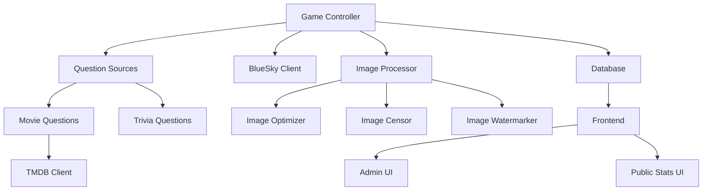
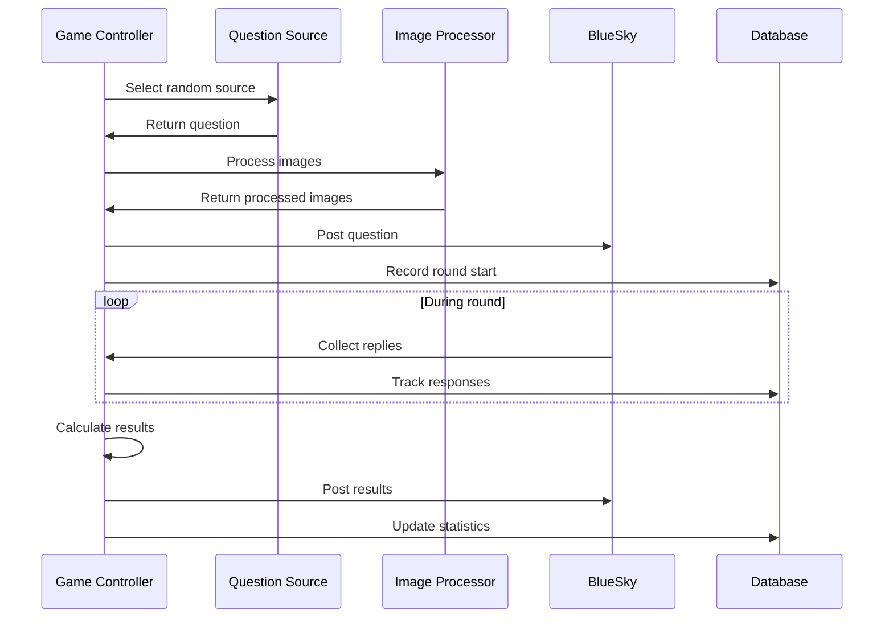
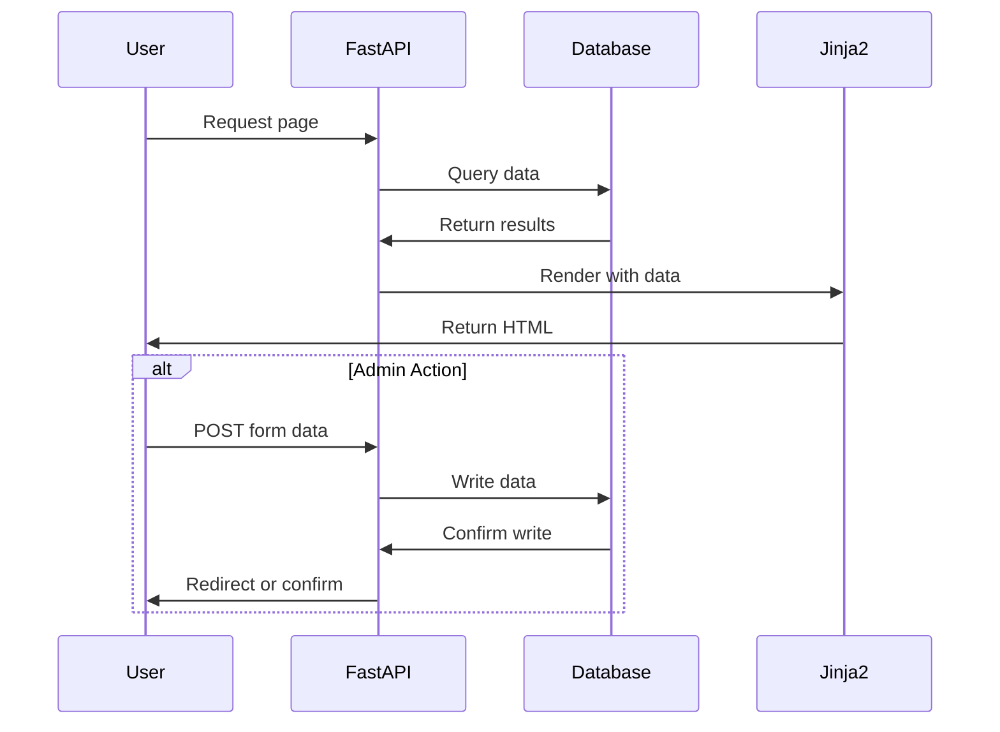
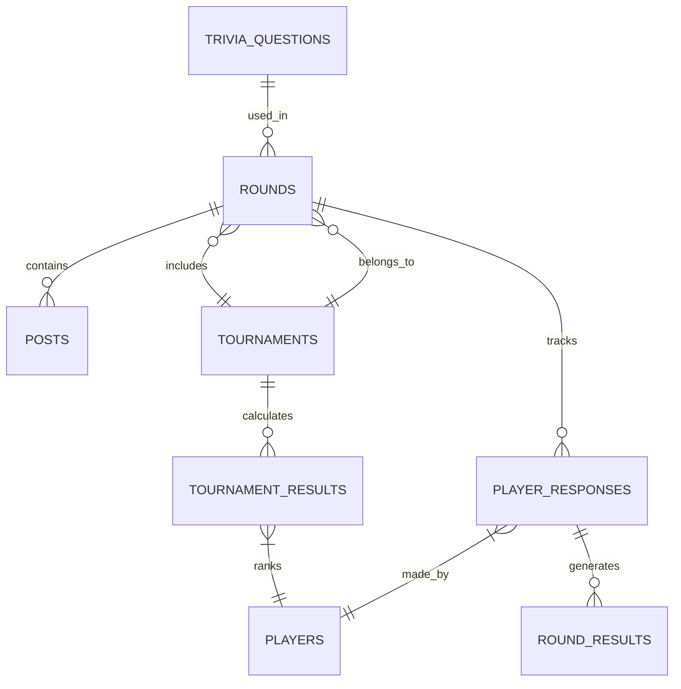
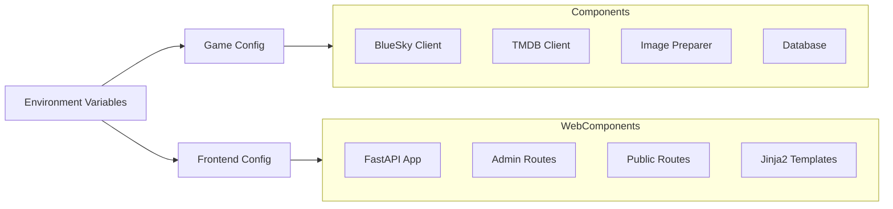

# System Patterns: BlueTrivia

## Core Architecture



## Key Components

### Game Controller (bmg/game/game.py)

- Orchestrates game flow and component interactions
- Manages round timing and state transitions
- Processes user responses and calculates results
- Configuration through environment variables

```python
class GameController:
    def __init__(self, config: GameConfig):
        self.bsky: BskyClient = config.bsky
        self.tmdb: TmdbClient = config.tmdb
        self.imgp: ImagePreparer = config.imgp
        self.db: Database = config.db
```

### Question Sources

Abstract interface pattern for extensible question types:

```python
class QuestionSource(ABC):
    @abstractmethod
    def get_question(self) -> Question:
        pass

class MovieQuestionSource(QuestionSource):
    def get_question(self) -> MovieQuestion:
        # Fetch from TMDB

class TriviaQuestionSource(QuestionSource):
    def get_question(self) -> TriviaQuestion:
        # Fetch from local database
```

### Image Processing Pipeline

Three-stage pipeline for image preparation:

1. **Optimization**

   - Resize to max 1280x720
   - JPEG compression with configurable quality
   - Memory-efficient buffer management

2. **Censoring**

   - Random visible window generation
   - Black rectangle overlay
   - Configurable coverage settings

3. **Watermarking**
   - TMDB attribution
   - Consistent positioning
   - Transparency handling

### Frontend Components (New)

The frontend follows a classic MVC pattern:

1. **Models**

   - Database connection and access layer
   - Object representation of database entities
   - Data validation and transformation

2. **Views**

   - Jinja2 templates for HTML rendering
   - Bootstrap for responsive styling
   - Tabbed interfaces for data organization

3. **Controllers**
   - FastAPI routes with dependency injection
   - Authentication via HTTP Basic Auth
   - Database connection management

## Critical Implementation Paths

### Game Flow



### Frontend Flow (New)



### Response Processing

1. Reply Collection
   - Monitor BlueSky posts during time window
   - Track response timing for leaderboards
2. Answer Evaluation
   - String cleaning and normalization
   - Fuzzy matching with configurable threshold
   - Position-based tracking for fastest answers

## Component Relationships

### Database Schema (Updated)



### Configuration Flow



## Design Patterns

1. **Strategy Pattern**
   - Question source selection
   - Image processing stages
2. **Observer Pattern**

   - Reply monitoring
   - Round state changes

3. **Factory Pattern**

   - Question creation
   - Image processor instantiation

4. **Repository Pattern**

   - Database access
   - API client implementations

5. **MVC Pattern** (New)

   - Model: Database entities
   - View: Jinja2 templates
   - Controller: FastAPI routes

6. **Dependency Injection** (New)
   - FastAPI dependency system
   - Database connection management

## Error Handling and Recovery

1. **API Failures**

   - Retry mechanisms
   - Fallback content
   - Error logging

2. **Data Consistency**

   - Transactional database operations
   - State validation
   - Round integrity checks

3. **Resource Management**

   - Memory-efficient image processing
   - Connection pooling
   - Cache management

4. **Frontend Errors** (New)
   - Graceful UI degradation
   - User-friendly error messages
   - Default values when data missing

## Performance Considerations

1. **Image Processing**

   - Buffer reuse
   - Optimal compression settings
   - Parallel processing when applicable

2. **Database Operations**

   - Indexed queries
   - Connection pooling
   - Batch operations

3. **API Interactions**

   - Rate limiting compliance
   - Response caching
   - Bulk operations where possible

4. **Frontend Performance** (New)
   - Minimal JavaScript usage
   - Server-side rendering
   - Bootstrap for efficient styling
   - Query optimization for dashboard statistics
